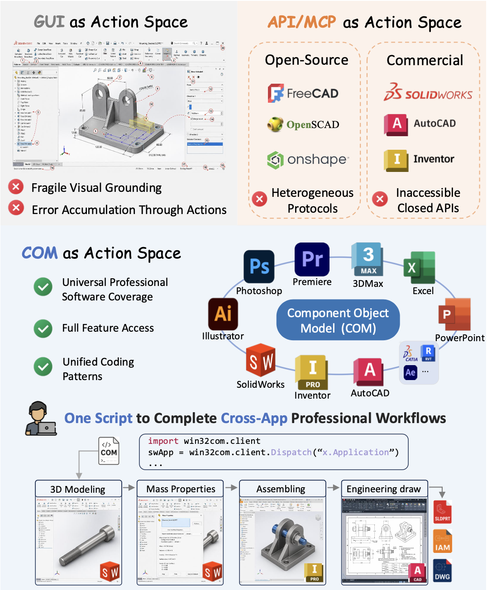
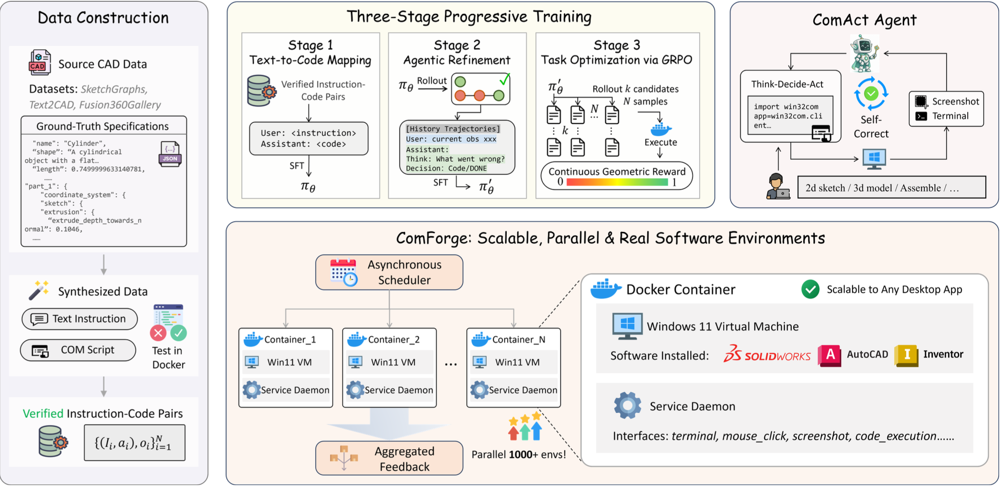

<div align="center">

# ComAct: Reframing Professional Software Manipulation through COM-as-Action Paradigm
</div>
<p align="center">
    <a href="https://arxiv.org/abs/2606.13239" target="_blank">
        
    </a>
    <a href="https://KnowledgeXLab.github.io/ComAct" target="_blank">
        
    </a>
    <a href="LICENSE" target="_blank">
        
    </a>
    <a href="https://huggingface.co/KnowledgeXLab/ComActor-9B" target="_blank">
        
    </a>
    <a href="https://huggingface.co/datasets/KnowledgeXLab/ComCAD_Bench" target="_blank">
        
    </a>
    <a href="https://huggingface.co/datasets/KnowledgeXLab/ComCAD_Datasets" target="_blank">
        
    </a>
</p>

The official implementation of **ComAct: Reframing Professional Software Manipulation via COM-as-Action Paradigm**. 
We identify the Component Object Model (COM) as a unified executable action space across professional software, reframing GUI-fragile, API-fragmented automation as deterministic program synthesis.
See the [project page](https://KnowledgeXLab.github.io/ComAct) for demos and full results.

<div align="center">
<table align="center">
<tr>
<td></td>
<td></td>
</tr>
</table>
</div>

## 📰 Updates
- **`2026-06-20`**: 🎉 Paper and project page are publicly available.

## 🎯 Getting Started

> 🚧 Coming soon: a detailed guide for preparing dataset, setting up VM environment and running agent training & evaluation end-to-end.

Here's a quick orientation:

| Component       | Description | Link                                                                               |
|-----------------|---|------------------------------------------------------------------------------------|
| **Benchmark**   | 1,000 tasks across SolidWorks, Inventor, AutoCAD; 7 engineering activities | [🤗 ComCADBench](https://huggingface.co/datasets/KnowledgeXLab/ComAct/ComCADBench) |
| **Environment** | Parallel Dockerized Windows VMs for training & evaluation | [`comforge/`](comforge/)                                                           |
| **Agent**       | 9B self-correcting agent via 3-stage training: text-to-code SFT → agentic SFT → GRPO | [🤗 ComActor](https://huggingface.co/KnowledgeXLab/ComAct/ComActor-9B)             |

## 🎓 Acknowledgements
We acknowledge the outstanding open-source contributions from [Qwen3.5](https://qwenlm.github.io/blog/qwen3.5/), [ms-swift](https://github.com/modelscope/ms-swift), [Text2CAD](https://github.com/SadilKhan/Text2CAD), [Fusion 360 Gallery](https://github.com/AutodeskAILab/Fusion360GalleryDataset), and [SketchGraphs](https://github.com/PrincetonLIPS/SketchGraphs).

## 📬 Contact
For any questions or feedback, please:
- Open an issue in the GitHub repository
- Reach out to us at julyai@whu.edu.cn

## 📜 Citation
If you find our paper and code useful, please kindly cite us.
```bibtex
@misc{ai2026comactreframingprofessionalsoftware,
      title={ComAct: Reframing Professional Software Manipulation via COM-as-Action Paradigm},
      author={Jiaxin Ai and Tao Hu and Xuemeng Yang and Shu Zou and Hairong Zhang and Daocheng Fu and Yu Yang and Hongbin Zhou and Nianchen Deng and Pinlong Cai and Zhongyuan Wang and Botian Shi and Kaipeng Zhang and Licheng Wen},
      year={2026},
      eprint={2606.13239},
      archivePrefix={arXiv},
      primaryClass={cs.SE},
      url={https://arxiv.org/abs/2606.13239},
}
```